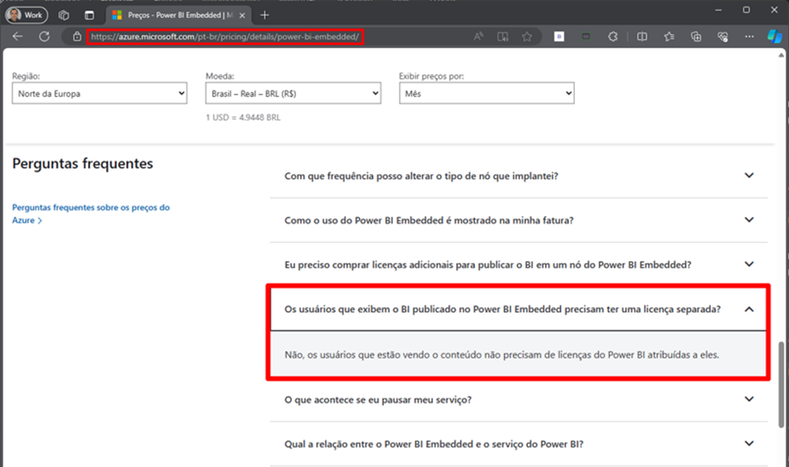

# Para acessar relatórios sem ter licença PRO não é apenas a partir do F64?

### Introdução

Uma dúvida bem comum é com relação ao licenciamento F64/P1 e Embedded.

Alguns clientes acreditam que apenas utilizando o licenciamento F64/P1 ou superior que permite acessar os relatórios sem ter uma licença PRO. Outros acreditam que mesmo com o Fabric, ainda precise ter também, uma capacidade do Power BI Embedded, ou que apenas a partir de uma certa capacidade que possa utilizar para embeddar os relatórios.

Vamos agora explicar melhor exatamente como funciona esse licenciamento.

### As capacidades F64 e P1

Usuários podem acessar os relatórios pelo Power BI serviço em um workspace associado à uma capacidade F64 ou acima (ou Premium por Capacidade = P1), utilizando contas gratuitas, sem necessidade de ter contas Pro para cada usuário. E isso é uma verdade.

Se você tem uma licença do Power BI Embedded ou Microsoft Fabric menor que a F64, para que os usuários acessem os relatórios **pelo portal do Power BI (app.powerbi.com)**, você realmente precisará que **todos eles tenham uma licença PRO** do Power BI.

Porém, quando falamos de Embedded Analytics e do Power Embedded, encontramos alternativas mais baratas para esse licenciamento.

### Utilizando Embedded Analytics para redução de custo

Mesmo utilizando uma capacidade abaixo da F64, com o F2, F4, F8, etc ou uma capacidade do Power BI Embedded, você pode visualizar os relatórios do Power BI pelo portal do Power Embedded ao invés de acessar os relatórios pelo portal do Power BI (app.powerbi.com).

**Utilizando o portal do Power Embedded, seus usuários NÃO precisarão de ter licenças PRO para acessar os relatórios inseridos na aplicações web.**

**Qualquer capacidade do Fabric ou do Power BI Embedded permite visualizar os relatórios no Power Embedded**, e seus usuários podem visualizem os relatórios utilizando qualquer email, sem precisar nem de ter conta Microsoft e nem nenhuma licença por usuário (PRO ou PPU).

Neste [link aqui](https://powerbi.microsoft.com/pt-br/blog/power-bi-embedded-with-microsoft-fabric/), a Microsoft mostra que o Microsoft Fabric também pode ser utilizado normalmente para inserir relatórios em aplicações terceiras em qualquer tamanho de capacidade.

<figure><figcaption></figcaption></figure>

Falando sobre o licenciamento por capacidade, no [link abaixo](https://azure.microsoft.com/pt-br/pricing/details/power-bi-embedded/), a Microsoft deixa bem claro que os usuários que estão vendo o conteúdo publicado no Power BI Embedded não precisam de licenças do Power BI atribuídas a eles, portanto, não é necessário uma licença PRO para visualização dos relatórios através do Power Embedded.

<figure><figcaption></figcaption></figure>
