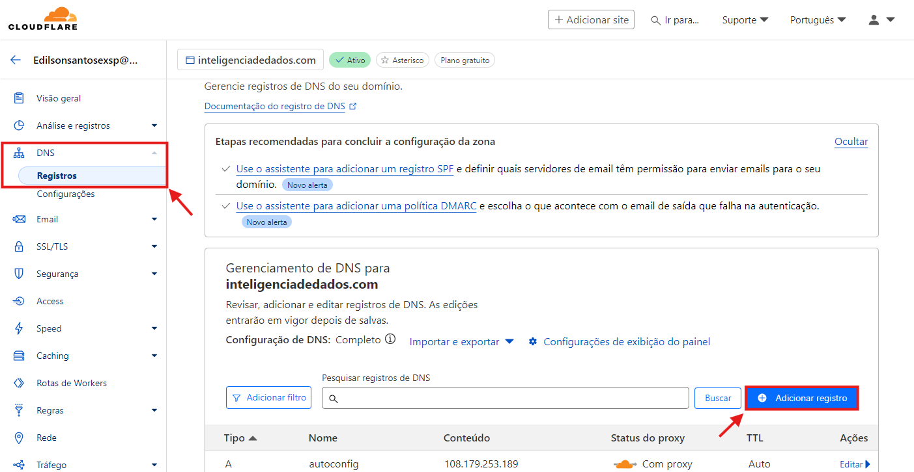

# Cloudflare

Se você usa a Cloudflare para gerenciamento de DNS e precisa inserir as entradas TXT e CNAME para configurar seu subdomínio no Power Embedded, basta seguir os passos abaixo:

&#x20;

**1. Acesse a Cloudflare:** [Clique aqui](https://dash.cloudflare.com/) para acessar o site da Cloudflare e na página inicial da Cloudflare, clique no seu domínio.

<figure><figcaption></figcaption></figure>

&#x20;

**2.** No menu lateral, clique na opção **DNS** e depois em **Registros**.

3\. Na tela que foi aberta, clique no botão Adicionar registro.

<figure><figcaption></figcaption></figure>

&#x20;

**4.** Na tela de adicionar registros DNS, selecione o tipo CNAME, digite o nome do subdomínio desejado, insira o valor powerportal-client.azurewebsites.net no campo Destino, desative a opção Status do proxy e salve as alterações.

&#x20;O campo Nome é que vai definir o endereço do subdomínio. Se você digitar “bi”, a URL de acesso será bi.seudominio.com.br

&#x20;

**5.** Clique novamente em **Adicionar registro** e selecione o tipo **TXT**.&#x20;

Insira o valor asuid.bi no campo Nome, o valor fornecido para o TXT (D1B15490F13A639D57FF7985A837F7E5242DD6F062BEEC8698E3CC36A6CBD693) no campo Conteúdo e salve as alterações.

Caso o seu subdomínio não seja “bi”, você deverá alterar o valor do campo Nome para o padrão asuid.seu\_subdominio, ou seja, se quiser que se chame powerbi.seudominio.com.br, o valor esse campo deverá ser asuid.powerbi
