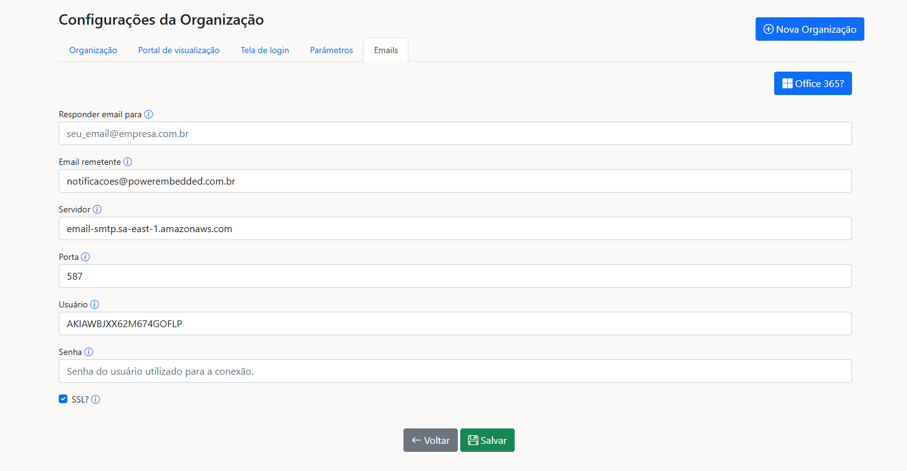

# Emails

Existem diversas ações que acionam o envio de e-mails no Power Embedded.

Para garantir um nível maior de personalização na entrega dessas mensagens, é possível configurar uma conta SMTP da sua empresa, para que até os envios de emails utilizem a sua identidade visual.

<figure><figcaption></figcaption></figure>

**Observação:** Caso o usuário precise responder a um e-mail enviado pelo sistema, você pode separar entre o e-mail responsável pelo envio e aquele para o qual o usuário pode enviar mensagem.


Caso não seja configurada uma conta SMTP, por padrão essas comunicações serão enviadas pelo e-mail padrão do PowerEmbedded (notificacoes@powerembedded.com.br)


### Ações que acionam o envio de e-mails.

* Esqueceu a senha?
* Criar ou alterar senha
* Reenviar email de confirmação para o primeiro acesso
* Assinatura de relatório
* Requisição de acesso a um relatório
* Notificação de importação de relatório
* Acesso negado ao relatório
* Acesso negado a importação de relatório
