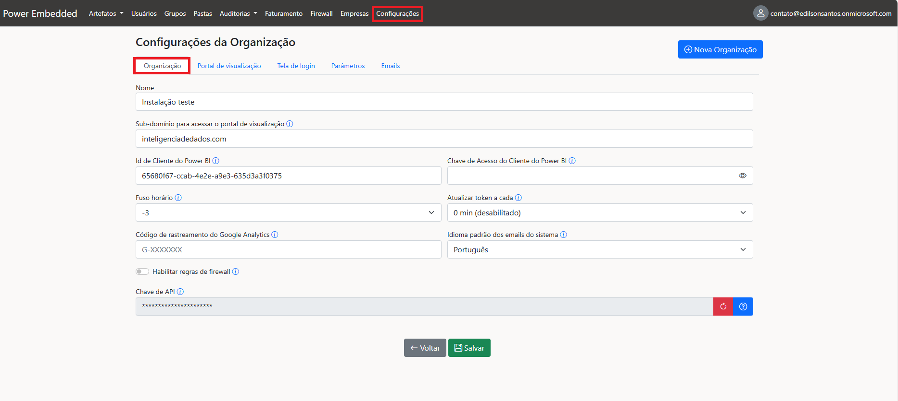
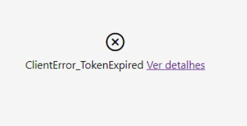

# Organização

### Configurando a organização

Para auxiliar na configuração deste ambiente, segue um passo a passo de como funciona cada campo:

<figure><figcaption></figcaption></figure>

**Nome:** Definir um nome para a organização é muito importante, pois será o nome visível para os usuários no portal de visualização e nos e-mails que eles receberão.

**Sub-domínio:** Aqui você pode configurar um subdomínio personalizado para sua empresa. [Saiba mais](../../configuracao-dns/).

**ID de Cliente do Power BI:** Identificação do aplicativo (Client ID) usado para a conexão do PowerEmbedded. [Saiba mais.](../../../documentacao-tecnica/instalacao/trial-do-fabric.md)

**Chave de acesso do cliente do Power BI:** Segredo (senha) gerado para o aplicativo de conexão do PowerEmbedded. Caso não informe um novo valor, será mantido o valor anterior cadastrado. [Saber mais.](alterar-senha-do-aplicativo.md)

**Fuso horário:** Defina o fuso horário local da empresa (Brasil = -3).

**Atualizar Token a cada:** Quando um relatório é acessado, o token gerado tem validade de 1 hora. Caso o usuário deixe a tela aberta, o token pode expirar. Configurar esta opção permite atualizar o token periodicamente, evitando desconexões por expiração.

<figure><figcaption></figcaption></figure>

Um erro como esse pode aparecer para o usuário quando acessar um relatório se o token tiver expirado.

**Código de rastreamento do Google Analytics:** Código utilizado para coletar e analisar informações sobre o uso do portal de relatórios pelo Google Analytics.

**Idioma padrão dos e-mails do sistema:** Idioma dos e-mails enviados pelo sistema. Em alguns casos, o sistema pode ignorar este campo e usar o idioma do responsável pela ação que gerou o e-mail.

**Habilitar Regras de Firewall:** Ative esta opção para permitir acesso ao portal de visualização apenas de IPs nas faixas liberadas pelo administrador. Uma vez ativada e o primeiro IP adicionado, o acesso será restrito aos IPs permitidos. [Controle de Acessos com Firewall.](../../firewall/)

**Chave de API:** Chave de segurança para autenticar chamadas da API de integração (Api.powerembedded.com.br). APIs para integrar o Power Embedded à sua aplicação.[APIs para integrar o Power Embedded na sua aplicação.](../../../documentacao-tecnica/api/automacoes-com-apis.md)

Essa funcionalidade permite criar múltiplas organizações em um único tenant. Isso significa que, caso você queira ter ambientes distintos, usuários e relatórios separados, você pode criar uma nova organização.

### Nova Organização

Esse botão permite criar múltiplas organizações em um único tenant / instalação.

Isso significa que, caso você queira ter ambientes distintos, usuários e relatórios separados, você pode criar uma nova organização.


[varias-empresas-ou-organizacoes.md](../../empresas/varias-empresas-ou-organizacoes.md)


