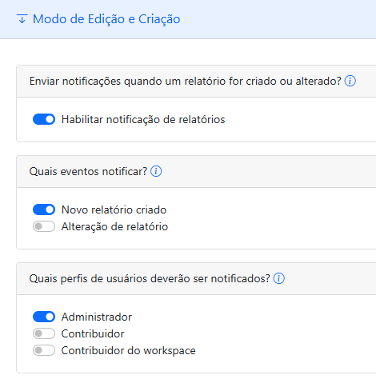
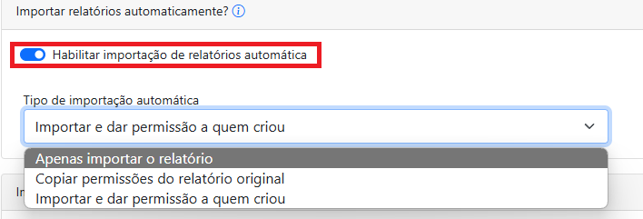
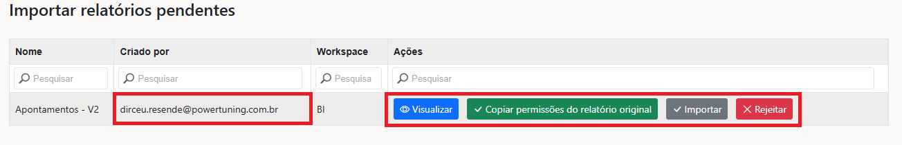
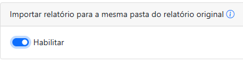

# Modo de edição e criação

Em **Configurações > Modo de Edição e Criação**, é possível visualizar os campos, como mostrado na imagem abaixo.

<figure><figcaption></figcaption></figure>

### **Enviar notificações quando um relatório for criado ou alterado**

Se você habilitar esta opção, todos os relatórios que forem criados ou modificados serão notificados por e-mail.

### **Quais eventos notificar**

Conforme mencionado acima, é possível selecionar quais ações deseja ser notificado, podendo escolher entre criar ou somente em caso de alteração, ou ambos.

### **Quais perfis de usuários deverão ser notificados**

Para direcionar melhor as informações, também é possível escolher quais perfis serão notificados, podendo escolher todos os três, se desejar. Essa notificação é enviada tanto no email, quanto no próprio portal de administração.

### **Importar relatórios automaticamente**

<figure><figcaption></figcaption></figure>

Com essa opção ativada, se um usuário criar ou alterar um relatório e salvar uma cópia, a cópia será importada automaticamente para o portal.\
\
Por padrão, essa cópia é salva no Workspace do relatório original e, sem essa permissão habilitada, seria necessário fazer a importação manualmente. \
\
Nesse caso, uma notificação será enviada no e-mail e no portal informando sobre relatórios pendentes.\
\
Ao clicar na notificação, você será redirecionado para uma tela de importação e análise do relatório, como mostrado na imagem abaixo.

<figure><figcaption></figcaption></figure>

A partir disso, você consegue ter uma governança para analisar e verificar o que o usuário criou ou editou, podendo importar ou rejeitar esses relatórios. Além disso, nessa mesma permissão, existem outras funcionalidades relacionadas.

&#x20;

Nesta opção, existem três possibilidades:

<figure><figcaption></figcaption></figure>

* **Apenas importar o relatório?** O relatório será importado sem nenhuma permissão e será necessário atribuir quais usuários irão visualizar.
* **Copiar permissões do relatório original:** As mesmas permissões que o relatório origem tem, essa cópia herda.
* **Importar e dar permissão a quem criou:** O relatório é importado automaticamente com o acesso somente de quem criou.

### **Importar relatório para a mesma pasta do relatório original**

Caso esta opção esteja habilitada, o relatório será automaticamente importado para a mesma pasta do relatório original.

<figure><figcaption></figcaption></figure>

