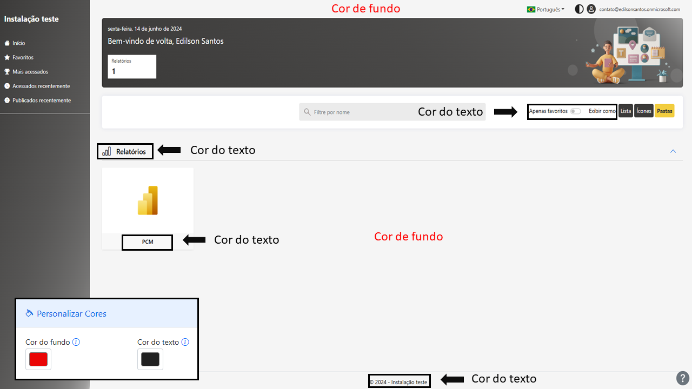
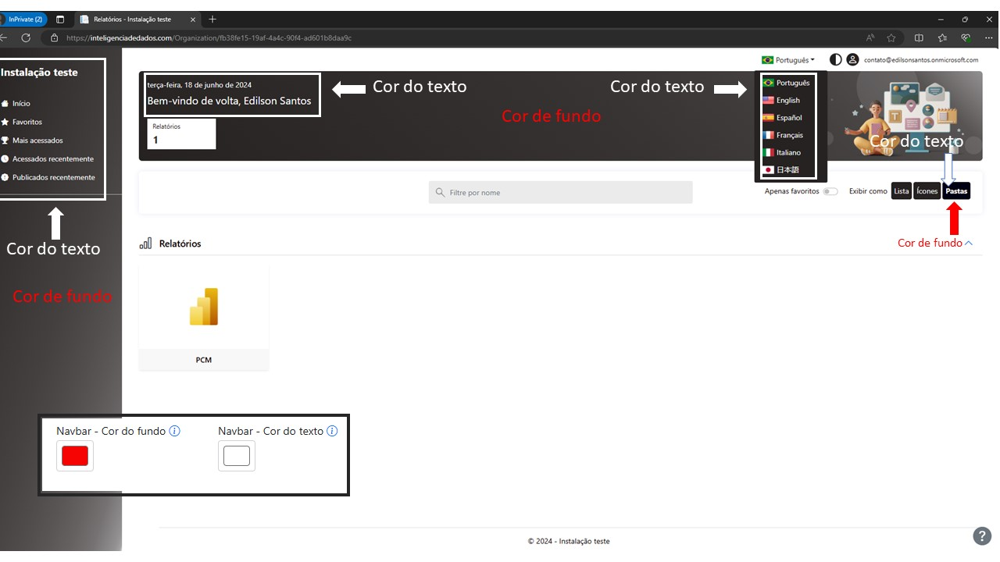
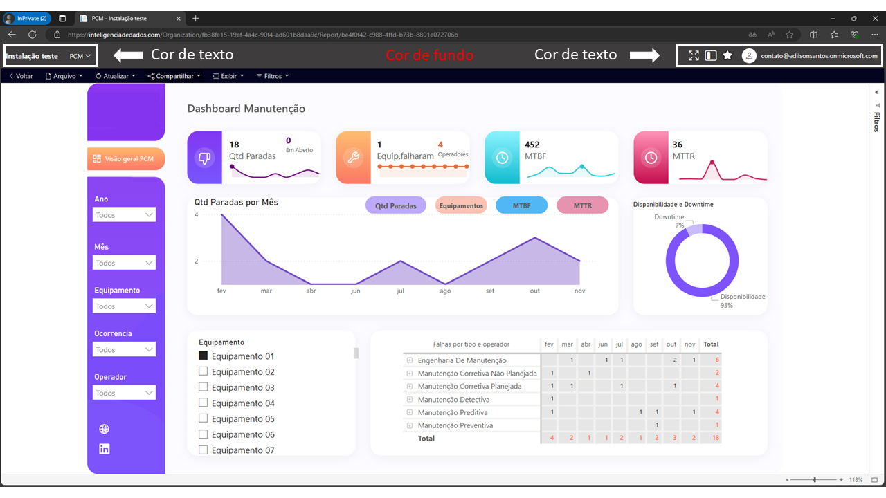
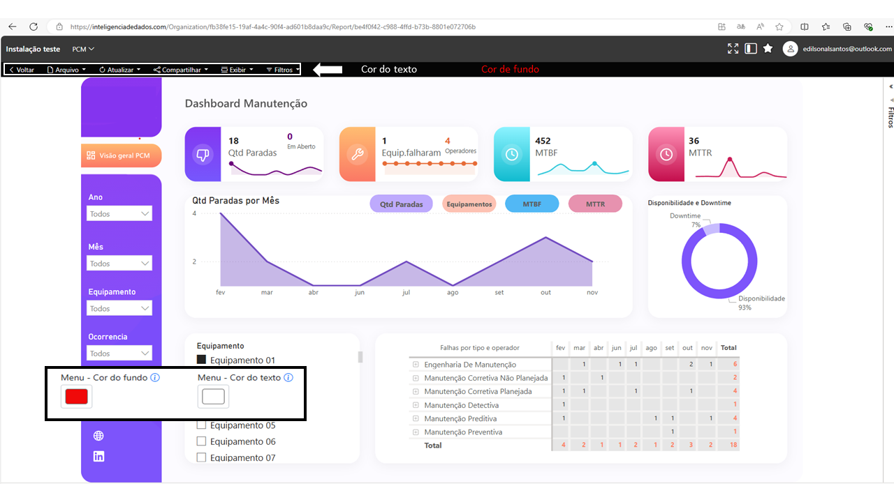
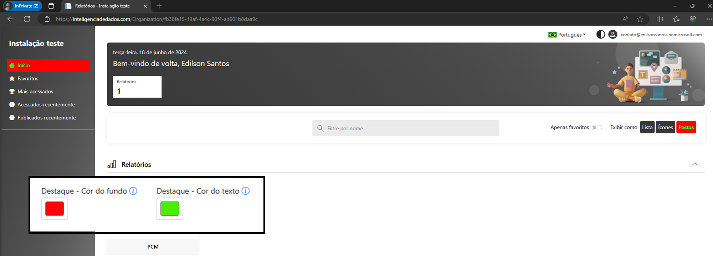

# Personalizar cores

### Cor de fundo e texto

Segue abaixo uma demonstração das áreas que vão sofrer alterações.

<figure><figcaption></figcaption></figure>

### Navbar

<figure><figcaption></figcaption></figure>

Além de fazer a alteração no portal inicial, no navbar de relatório ocorre a alteração.

<figure><figcaption></figcaption></figure>

### Menu – Cor de fundo e texto

<figure><figcaption></figcaption></figure>

### Destaque

Cor mostrada ao passar o mouse sobre algum elemento do portal de visualização.

<figure><figcaption></figcaption></figure>
