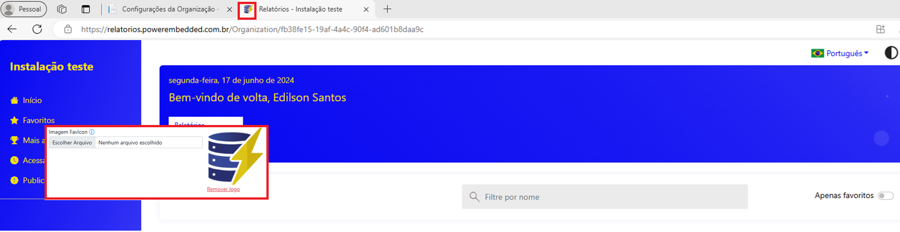
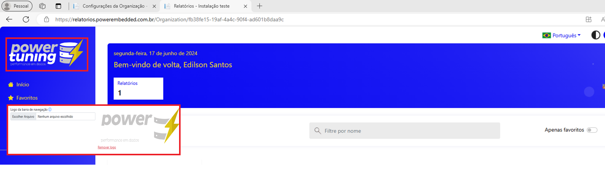
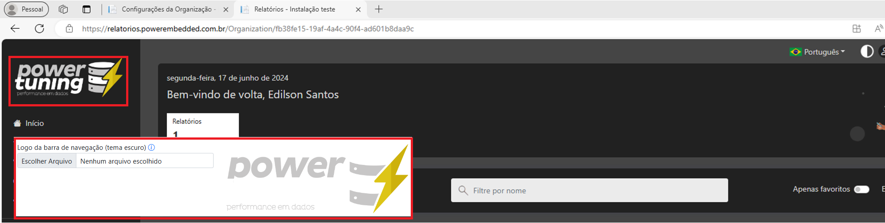
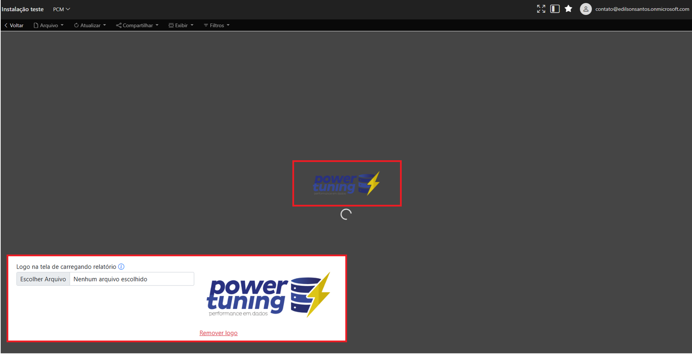
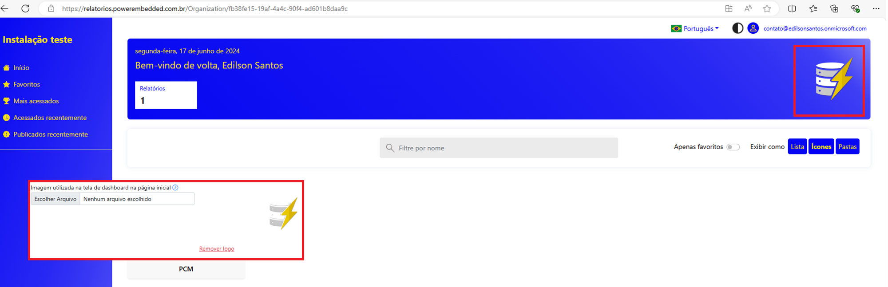
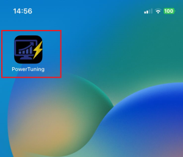

# Personalizar imagens

### Favicon

<figure><figcaption></figcaption></figure>

### Logo da barra de Navegação

<figure><figcaption></figcaption></figure>

### Logo da barra de navegação (tema escuro)

<figure><figcaption></figcaption></figure>

### Logo na tela de carregando relatório

<figure><figcaption></figcaption></figure>

### Imagem utilizada na tela de dashboard da página inicial

<figure><figcaption></figcaption></figure>

### Ícone do aplicativo (512 x 512) - Mobile

<figure><figcaption></figcaption></figure>

### Ícone do aplicativo (192 x 192) - Desktop

<figure><figcaption></figcaption></figure>
