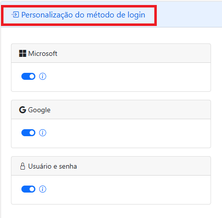
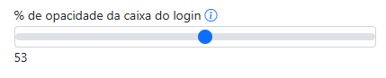
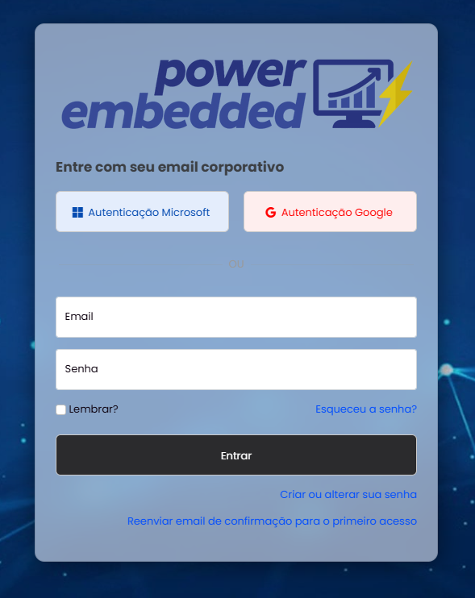

# Métodos de autenticação

### Personalização do método de login

O Power Embedded suporta três métodos de autenticação, e você poderá escolher quais serão suportados e mostrados na tela de login.

Caso você faça o bloqueio de algum método de autenticação, nenhum usuário conseguirá se autenticar utilizando esse método de login e ele não será mostrado na tela de login.

Se esse método de autenticação estiver ativado, ele será mostrado na tela de login, mas você poderá bloquear ao nível do usuário, para que esse usuário específico não consiga utilizar esse método de autenticação.

<figure><figcaption></figcaption></figure>

### **Alterar a opacidade do layout**

Configuração que permite definir o quão transparente a tela de login será mostrada

<figure><figcaption></figcaption></figure>

<figure><figcaption>
Opacidade em 0%
</figcaption></figure>

 

<figure><figcaption>
Opacidade em 20%
</figcaption></figure>

 

<figure><figcaption>
Opacidade em 50%
</figcaption></figure>

 

<figure><figcaption>
Opacidade em 100%
</figcaption></figure>


Se você configurar o nível de opacidade em 100%, a transparência será desativada. Configurando em 0%, a tela de login será totalmente transparente.


### Sempre expandir opções de usuário/senha

Opção que permite expandir automaticamente os campos de usuário/senha na tela de login

<figure><figcaption>
Opção marcada
</figcaption></figure>

 

<figure><figcaption>
Opção desmarcada
</figcaption></figure>

### Layout da página de login

Opção que permite configurar o layout da página do login conforme a sua preferência

<figure><figcaption>
Alinhado à esquerda
</figcaption></figure>

 

<figure><figcaption>
Centralizado
</figcaption></figure>

 

<figure><figcaption>
Alinhado à direita
</figcaption></figure>

