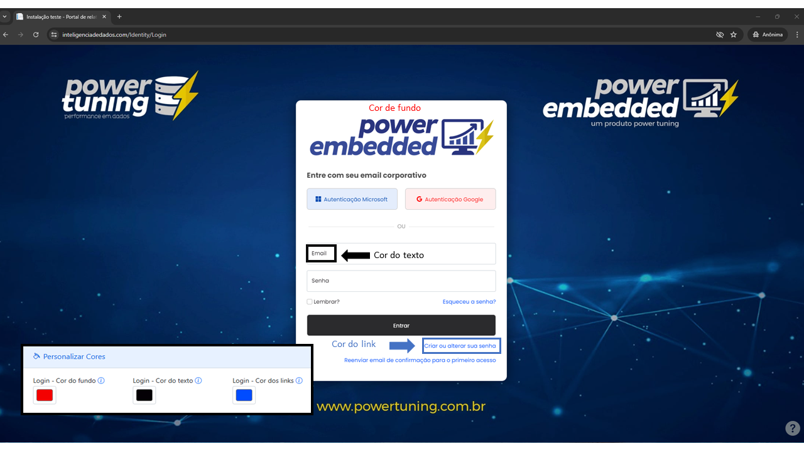
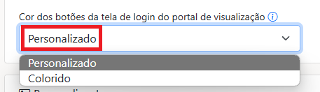
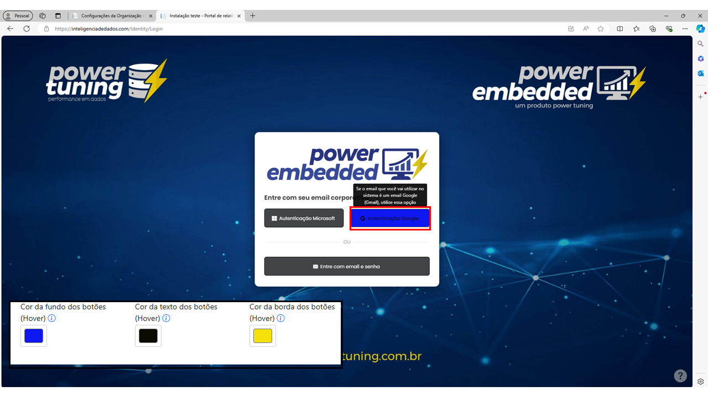

# Personalizar cores

### Login

<figure><figcaption></figcaption></figure>

### Botões

<figure><figcaption></figcaption></figure>

**Atenção:** a personalização dos **botões** acima, só será efetiva caso o drop-down esteja na opção “Personalizado”.

<figure><figcaption></figcaption></figure>

Caso você deixe marcado na opção "Colorido", os botões terão uma cor padrão conforme o método de autenticação.

<figure><figcaption></figcaption></figure>

### Hover

Essa cor é visível quando o usuário passa o mouse sobre o elemento.

<figure><figcaption></figcaption></figure>
