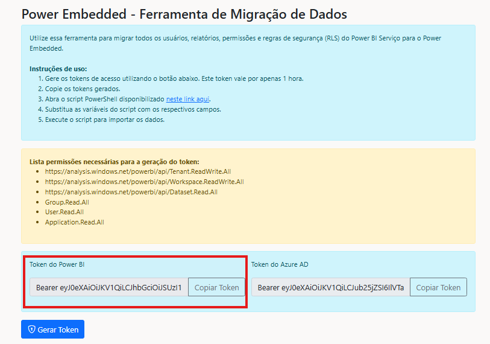
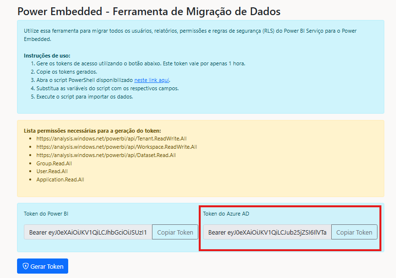

# Migração

Para simplificar a configuração do Power Embedded, preparamos um script que automatiza o processo de importação de usuários, RLS e relatórios do Power BI para o Power Embedded de forma simples e fácil.

## Requisitos

Para conseguir executar o processo de migração é importante está com as seguintes permissões habilitadas:

Permissão de admin do usuário de serviço

Essa permissão precisa está habilitada em todos os workspaces que irão está disponível no portal.

Para adicionar o Service Principal criado como administrador de um workspace, acesse o workspace, clique nos 3 pontinhos e selecione a opção “Gerenciar acesso

Clique no botão “+ Adicionar pessoas ou grupos”

Pesquise pelo nome do aplicativo que foi criado anteriormente (PowerEmbedded-App) e lembre de alterar o nível de acesso para “Administrador”. Após isso, clique no botão “Add”

Pronto! Agora o Power Embedded já possui acesso nesse workspace. Repita isso para todos os Workspaces que você quer importar relatórios.

Permissões Leitura API

Permissões para a importação de dados do Entra ID

Para ser possível importar dados de usuários e grupos do Entra ID, é necessário atribuir algumas permissões para o Service Principal, criado no Portal do Azure, utilizado pelo Power Embedded para se comunicar com o seu ambiente.

Na tela de [Registro de aplicativos](https://portal.azure.com/#view/Microsoft\_AAD\_IAM/ActiveDirectoryMenuBlade/\~/RegisteredApps), pesquise pelo nome do aplicativo criado (O nome padrão é PowerEmbedded-App).

Na tela do aplicativo, clique em _API permissions_, no menu lateral e depois em _Add a Permission_.

Na próxima tela selecione a opção do _Microsoft Graph_.

Em seguida selecione a opção de _Application permissions_.

Na aba a seguir, busque por _Directory_ e selecione a primeira opção _Directory.Read.All_ e clique em _Add permissions_.

Para finalizar basta conceder o consentimento do administrador clicando em _Grant admin consent for_.

Pronto, agora você já conseguirá importar os usuários e grupos do Azure AD (Entra ID) para o Power Embedded.

## Instruções

Com as devidas permissões habilitadas agora é só seguir o passo a passo de processo.

Vá ao portal de administração do Power Embedded no menu de migração, siga estas etapas. Nesse menu siga as instruções abaixo.

**Etapa 1:** Gere os tokens de acesso utilizando o botão abaixo e copie. O token gerado será válido por apenas 1 hora.

<figure><figcaption></figcaption></figure>

**Etapa 2:** Abra o script PowerShell disponível no link dessa página, copie e cole no console do PowerShell.

**Etapa 3**: Substitua as variáveis do script pelos respectivos valores

<figure><figcaption></figcaption></figure>

**ID de Cliente do Power BI**: Acesse o Portal de Administração do Power BI Embedded > Configurações > campo “ID de Cliente do Power BI”.

<figure><figcaption></figcaption></figure>

**Chave de API**: Acesse o Portal de Administração do Power BI Embedded > Configurações > campo “Chave de API” (clique no ícone em vermelho para gerar a chave).

<figure><figcaption></figcaption></figure>

**Pbi Token:** Chave Gerada no menu de migração

<figure><figcaption></figcaption></figure>

**Ad Token :** Chave gerada no menu de migração.

<figure><figcaption></figcaption></figure>

Com os campos preenchidos agora é só rodar o código no Power Shell.

<figure><figcaption></figcaption></figure>

Com o script finalizado, todos os relatórios, usuários, e rls estarão importados no Power Embedded.
