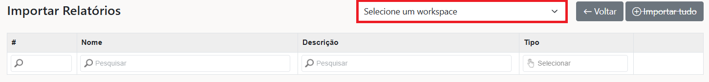
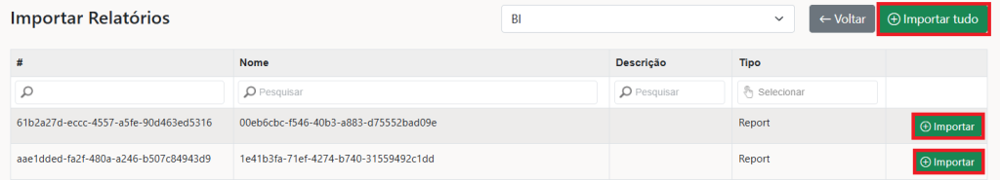
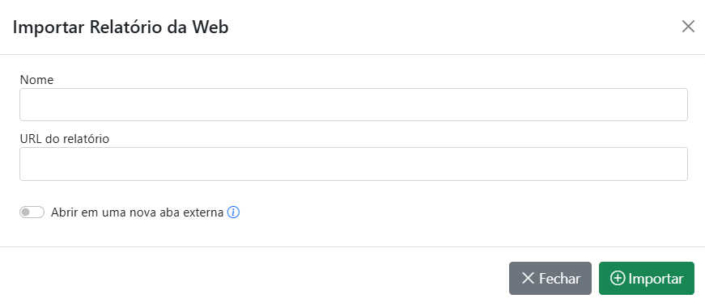
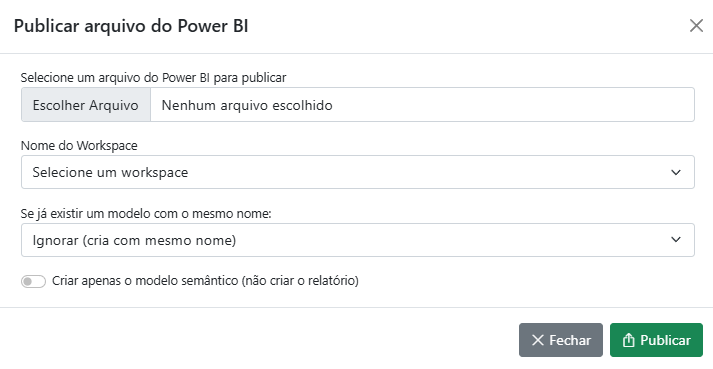

# Primeiro Acesso


Para personalizar a URL do portal e utilizar o seu domínio, acesse [Configuração de DNS](configuracao-dns/).



Para que o faturamento automático do sistema gere as cobranças nos vencimentos desejados e envie para a lista de pessoas correta ou informar número do pedido de compras, acesse [Configurações de Faturamento](https://admin.powerembedded.com.br/Organization/BillingSettings/).


### Criação dos usuários

O primeiro passo para começar a utilizar o Power Embedded, é configurar os usuários que irão administrar a plataforma e os que irão apenas visualizar os relatórios.

Para acessar essa tela, [clique aqui](https://admin.powerembedded.com.br/Users).

Após a criação dos usuários, lembre-se de definir as permissões desses usuários, configurar quais grupos eles fazem parte, quais relatórios irão acessar e as permissões que eles terão.


Para saber mais sobre a criação e gerenciamento dos usuários, acesse a página [Gerenciamento de Usuários](usuarios/).


Você pode criar usuários de várias formas diferentes:

* Criar manualmente os usuários, preenchendo os campos do formulário de cadastro
* Importar uma lista de usuários a partir de arquivos CSV
* Importar uma lista de usuários a partir do Entra ID (Azure AD)
* Utilizar a API para integração com qualquer sistema ou linguagem de programação

<figure><figcaption>
Tela inicial do cadastro de usuários
</figcaption></figure>

### Criação dos grupos

Os grupos no Power Embedded são uma forma de facilitar a gestão e governança dos usuários, agrupando-os para facilitar o gerenciamento das permissões, RLS e acessos a relatórios.

Para acessar essa tela, [clique aqui](https://admin.powerembedded.com.br/Groups).


Para saber mais sobre a criação e gerenciamento dos grupos, acesse a página [Gerenciamento de Grupos](grupos/).


Você pode criar os grupos de várias formas:

* Criar manualmente os grupos, preenchendo os campos do formulário manualmente
* Importar os grupos a partir de arquivos CSV
* Importar os grupos a partir do Entra ID (Azure AD) e opcionalmente, importar também os usuários deste grupos
* Sincronizar os grupos com o Entra ID (Azure AD), que irá criar/excluir os usuários no Power Embedded conforme o que acontece nesse grupo pelo Entra ID.

<figure><figcaption>
Tela inicial do cadastro de grupos
</figcaption></figure>

### Importação dos relatórios

Um passo crucial para que o portal funcione é a importação dos relatórios que serão acessados.

Para acessar essa tela, [clique aqui](https://admin.powerembedded.com.br/Reports).

#### Opções de importação

Existem três tipos de importação de relatórios:

1. **Relatório do Power BI**: Esta opção permite importar relatórios que já existem no Power BI.
2. **Relatório da Web**: É possível importar relatórios de diversas fontes online, como Google Data Studio, documentos no OneDrive, Tableau, etc, além de relatórios presentes nos Workspaces do Power BI.
3. **Arquivo do Power BI**: Com esta funcionalidade, você pode publicar arquivos PBIX diretamente no Power BI sem precisar utilizar o Power BI Desktop.

**Relatório do Power BI**

Nesta opção, você pode visualizar os workspaces em que o Power Embedded tem administração e importar esses relatórios.

<figure><figcaption></figcaption></figure>

Ao selecionar o workspace, serão listados todos os relatórios atribuídos a ele. Você pode optar por importá-los manualmente um a um ou importar todos de uma vez.

<figure><figcaption></figcaption></figure>

**Relatório Web**

No Power Embedded, você pode incorporar relatórios da Web ou documentos armazenados no SharePoint, OneDrive, entre outros. Por exemplo, se você possui um dashboard no Google Data Studio e precisa visualizá-lo aqui, basta inserir o link e ele será automaticamente reconhecido como um relatório externo no portal.

Como alguns sites não permitem esse processo de incorporação direta, oferecemos a opção de “Abrir em uma nova aba externa” para facilitar essa integração.

**Arquivo do Power BI**

Também é possível  publicar os relatórios do Power BI que estão localmente em seus computadores para os workspaces no Power BI serviço, dando uma liberdade e autonomia maior para os usuários.


Para saber mais sobre essa funcionalidade, acesse a página [Publicando relatórios no Power BI pelo Power Embedded](relatorios/publicar-relatorio-no-power-bi.md).


### Personalização do portal

Como o Power Embedded é um sistema white-label, totalmente personalizável, é nesta tela que você configura toda a personalização para uma experiência mais personalizada com a identidade visual da sua empresa.


Para ver mais detalhes sobre essa tela, acesse a página [Configurações](configuracoes/).


Na aba "Portal de visualização" você poderá definir as cores e imagens do portal de visualização.

<figure><figcaption></figcaption></figure>

Na aba "Tela de login", você poderá definir as cores e imagens da tela de login do portal de visualização.

<figure><figcaption></figcaption></figure>

Você também poderá personalizar os métodos de autenticação suportados pela plataforma e configurar outras personalizações da tela de login

<figure><figcaption></figcaption></figure>

Caso você faça o bloqueio de algum método de autenticação, nenhum usuário conseguirá se autenticar utilizando esse método de login e ele não será mostrado na tela de login.

Se esse método de autenticação estiver ativado, ele será mostrado na tela de login, mas você poderá bloquear ao nível do usuário, para que esse usuário específico não consiga utilizar esse método de autenticação.

### Principais documentações

<table data-view="cards"><thead><tr><th></th><th></th><th data-hidden data-card-cover data-type="files"></th><th data-hidden></th><th data-hidden data-card-target data-type="content-ref"></th></tr></thead><tbody><tr><td><strong>O que é o Power Embedded</strong></td><td>Um resumo deste produto</td><td><a href="../.gitbook/assets/Power Embedded - Ícone da Documentação (32).png">Power Embedded - Ícone da Documentação (32).png</a></td><td></td><td><a href="../inicio/o-que-e-o-power-embedded.md">o-que-e-o-power-embedded.md</a></td></tr><tr><td><strong>Perguntas frequentes</strong></td><td>E suas respostas</td><td><a href="../.gitbook/assets/Power Embedded - Ícone da Documentação (33).png">Power Embedded - Ícone da Documentação (33).png</a></td><td></td><td><a href="../perguntas-frequentes/">perguntas-frequentes</a></td></tr><tr><td><strong>Calculadora de Preços</strong></td><td>Quanto custa esse produto</td><td><a href="../.gitbook/assets/Power Embedded - Ícone da Documentação (29).png">Power Embedded - Ícone da Documentação (29).png</a></td><td></td><td><a href="https://powerembedded.com.br/calculadora">https://powerembedded.com.br/calculadora</a></td></tr><tr><td>Portal de <strong>Administração</strong></td><td>Como administrar o portal</td><td><a href="../.gitbook/assets/Design sem nome (42).png">Design sem nome (42).png</a></td><td></td><td><a href="visao-geral.md">visao-geral.md</a></td></tr><tr><td><strong>Portal de Relatórios</strong></td><td>A experiência dos usuários</td><td><a href="../.gitbook/assets/Design sem nome (43) (1).png">Design sem nome (43) (1).png</a></td><td></td><td><a href="../portal-de-relatorios/portal-de-relatorios/">portal-de-relatorios</a></td></tr><tr><td><strong>Segurança a nível de linha (RLS)</strong></td><td>Veja como realizar essa configuração</td><td><a href="../.gitbook/assets/Power Embedded - Ícone da Documentação (36).png">Power Embedded - Ícone da Documentação (36).png</a></td><td></td><td><a href="relatorios/seguranca-rls.md">seguranca-rls.md</a></td></tr><tr><td><strong>Pastas dos Relatórios</strong></td><td>Organize seus relatórios em pastas</td><td><a href="../.gitbook/assets/Power Embedded - Ícone da Documentação (34).png">Power Embedded - Ícone da Documentação (34).png</a></td><td></td><td><a href="pastas.md">pastas.md</a></td></tr><tr><td><strong>Chamados de Suporte</strong></td><td>Abra e visualize seus chamados</td><td><a href="../.gitbook/assets/Design sem nome (43).png">Design sem nome (43).png</a></td><td></td><td><a href="https://admin.powerembedded.com.br/Support">https://admin.powerembedded.com.br/Support</a></td></tr><tr><td><strong>Reunião de Suporte</strong></td><td>Precisa de ajuda rápida?</td><td><a href="../.gitbook/assets/Power Embedded - Ícone da Documentação (15).png">Power Embedded - Ícone da Documentação (15).png</a></td><td></td><td><a href="https://powerembedded.com.br/reuniao-suporte">https://powerembedded.com.br/reuniao-suporte</a></td></tr></tbody></table>

### Extraindo o melhor do Power Embedded

<table data-view="cards"><thead><tr><th></th><th></th><th data-hidden></th><th data-hidden data-card-target data-type="content-ref"></th><th data-hidden data-card-cover data-type="files"></th></tr></thead><tbody><tr><td><strong>Power Pilot</strong></td><td>Como usar a IA Generativa</td><td></td><td><a href="power-pilot-ia/">power-pilot-ia</a></td><td><a href="../.gitbook/assets/Power Embedded - Ícone da Documentação (37).png">Power Embedded - Ícone da Documentação (37).png</a></td></tr><tr><td><strong>Power Pilot no WhatsApp</strong></td><td>Seus dados pelo WhatsApp</td><td></td><td><a href="power-pilot-ia/ia-no-whatsapp.md">ia-no-whatsapp.md</a></td><td><a href="../.gitbook/assets/Power Embedded - Ícone da Documentação (38).png">Power Embedded - Ícone da Documentação (38).png</a></td></tr><tr><td><strong>Sincronização com Entra ID</strong></td><td>Adicione e remova usuários automaticamente</td><td></td><td><a href="grupos/sincronizar-com-entra-id.md">sincronizar-com-entra-id.md</a></td><td><a href="../.gitbook/assets/Power Embedded - Ícone da Documentação (39).png">Power Embedded - Ícone da Documentação (39).png</a></td></tr><tr><td><strong>Aplicativo móvel (PWA)</strong></td><td>Como utilizar o aplicativo para celular</td><td></td><td><a href="../portal-de-relatorios/aplicativo-movel-pwa.md">aplicativo-movel-pwa.md</a></td><td><a href="../.gitbook/assets/Power Embedded - Ícone da Documentação (6).png">Power Embedded - Ícone da Documentação (6).png</a></td></tr><tr><td><strong>Automações com API</strong></td><td>Como utilizar a API do sistema</td><td></td><td><a href="../documentacao-tecnica/api/automacoes-com-apis.md">automacoes-com-apis.md</a></td><td><a href="../.gitbook/assets/Power Embedded - Ícone da Documentação (19).png">Power Embedded - Ícone da Documentação (19).png</a></td></tr><tr><td><strong>Relatórios no seu sistema</strong></td><td>Como mostrar os relatórios em apps terceiras</td><td></td><td><a href="../documentacao-tecnica/api/mostrar-relatorio-no-seu-sistema.md">mostrar-relatorio-no-seu-sistema.md</a></td><td><a href="../.gitbook/assets/Power Embedded - Ícone da Documentação (40).png">Power Embedded - Ícone da Documentação (40).png</a></td></tr><tr><td><strong>Aplicativos</strong></td><td>Modo TV, Vários relatórios e muito mais</td><td></td><td><a href="aplicativos.md">aplicativos.md</a></td><td><a href="../.gitbook/assets/Power Embedded - Ícone da Documentação (41).png">Power Embedded - Ícone da Documentação (41).png</a></td></tr><tr><td><strong>Firewall do sistema</strong></td><td>Bloqueie acessos externos</td><td></td><td><a href="auditorias/firewall.md">firewall.md</a></td><td><a href="../.gitbook/assets/Power Embedded - Ícone da Documentação (21).png">Power Embedded - Ícone da Documentação (21).png</a></td></tr><tr><td><strong>Edição/criação de relatórios</strong></td><td>Gerencie o Self-service BI dos relatórios</td><td></td><td><a href="configuracoes/parametros/modo-de-edicao-e-criacao.md">modo-de-edicao-e-criacao.md</a></td><td><a href="../.gitbook/assets/Power Embedded - Ícone da Documentação (10).png">Power Embedded - Ícone da Documentação (10).png</a></td></tr><tr><td><strong>Modelos dinâmicos</strong></td><td>O que é e como utilizar</td><td></td><td><a href="relatorios/modelos-dinamicos.md">modelos-dinamicos.md</a></td><td><a href="../.gitbook/assets/Power Embedded - Ícone da Documentação (12).png">Power Embedded - Ícone da Documentação (12).png</a></td></tr><tr><td><strong>Auditorias</strong></td><td>Conheça todas as auditorias do sistema</td><td></td><td><a href="auditorias/">auditorias</a></td><td><a href="../.gitbook/assets/Power Embedded - Ícone da Documentação (42).png">Power Embedded - Ícone da Documentação (42).png</a></td></tr><tr><td><strong>Otimização da capacidade</strong></td><td>Reduza custos da capacidade</td><td></td><td><a href="artefatos/capacidades/otimizacao-de-custos.md">otimizacao-de-custos.md</a></td><td><a href="../.gitbook/assets/Power Embedded - Ícone da Documentação (8).png">Power Embedded - Ícone da Documentação (8).png</a></td></tr></tbody></table>

