# Aplicativo móvel (PWA)

O Power Embedded é compatível com dispositivos móveis através de um aplicativo próprio (PWA) e compatível com PC’s Windows, Mac, Linux e também com dispositivos móveis (Android e iOS).

Uma outra vantagem desse tipo de aplicativo, é que ele mantém a característica de _white-label_ que o sistema possui, ou seja, o ícone e o nome do aplicativo serão personalizados para o nome e ícone da sua empresa e não um nome e ícone genéricos, como são os aplicativos disponíveis da Apple Store e Google Play Store.

Para realizar a instalação em PC’s, basta acessar o endereço do portal de visualização no seu navegador preferido e vai aparecer uma notificação na barra de endereços e o ícone abaixo vai ficar disponível.

<figure><figcaption></figcaption></figure>

O navegador irá perguntar se você quer instalar o aplicativo e basta você confirmar que será criado um novo ícone na sua área de trabalho.

<figure><figcaption></figcaption></figure>

Ao abrir esse aplicativo, você irá direto para a página do Power Embedded e as barras de endereço vão ficar ocultas para ter maior espaço na tela para acessar o website.

Logo abaixo, você verá as instruções de como instalar o aplicativo nos navegadores dos dispositivos móveis.

## Tutorial de instalação

### Safari

Para instalar o aplicativo móvel do Power Embedded, acesse o portal de relatórios, seja com a URL padrão (relatorios.powerembedded.com.br) ou utilizando a sua URL personalizada.

1. Com a tela de login aberta (pode ser qualquer página, na verdade), clica no botão de compartilhar.
2. No menu que foi aberto, clique no botão “Adicionar à Tela de Início”
3. Na tela para adicionar na tela de início, clique no botão “Adicionar”
4. Pronto! O aplicativo foi instalado e um atalho foi adicionado na área de trabalho do seu iPhone.

<figure>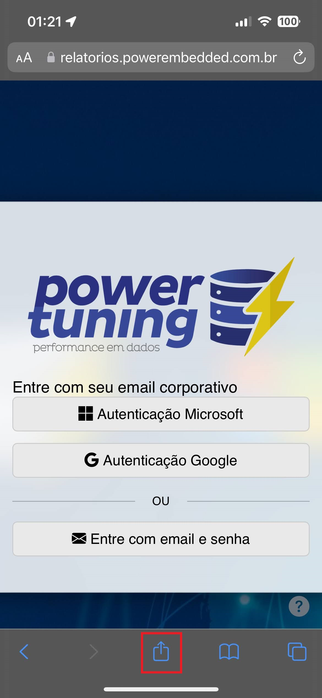<figcaption>
Tela inicial – Clique no botão de Compartilhar
</figcaption></figure>

 

<figure>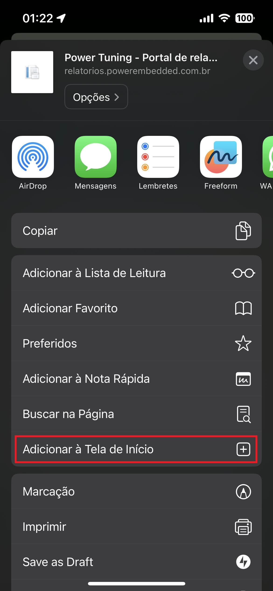<figcaption>
Menu – Clique em “Adicionar à tela de início”
</figcaption></figure>

 

<figure>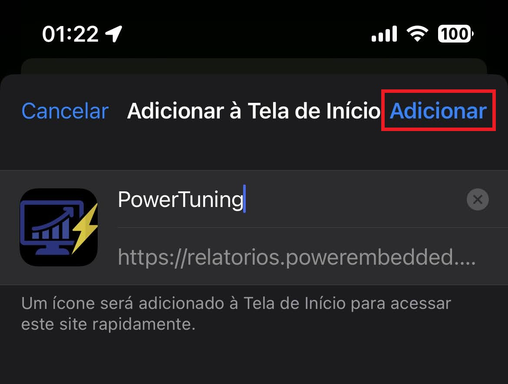<figcaption>
Criando o app – Clique em Adicionar
</figcaption></figure>

 

<figure><figcaption>
O atalho
</figcaption></figure>

 

<figure>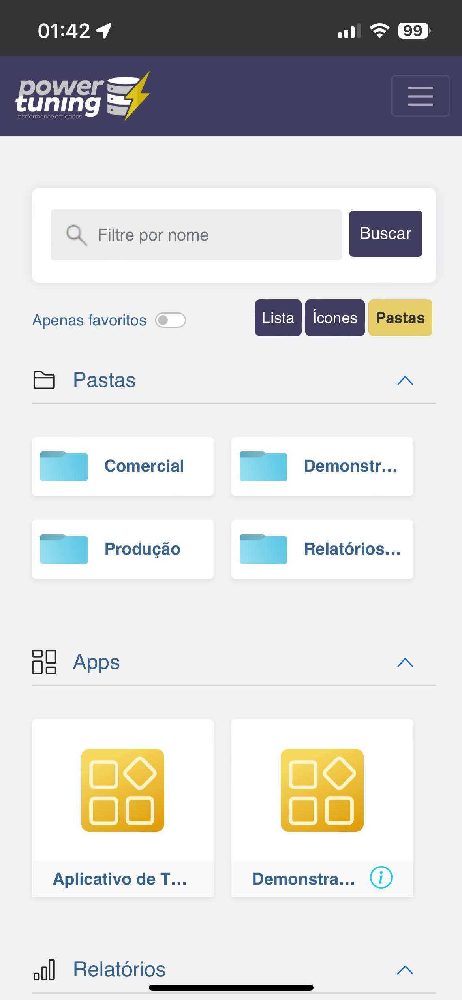<figcaption>
Screenshot
</figcaption></figure>

### Samsung Internet

Para instalar o aplicativo móvel do Power Embedded, acesse o portal de relatórios, seja com a URL padrão (relatorios.powerembedded.com.br) ou utilizando a sua URL personalizada.

1. &#x20;Toque no ícone do menu e selecione a opção “Adicionar página a”
2. &#x20;No menu que apareceu, toque na opção “Tela inicial”
3. &#x20;Na tela de “Adicionar à Tela Inicial”, clique no botão “Adicionar”
4. Você verá uma notificação informando que o aplicativo foi adicionado à Tela Inicial.
5. Agora basta tocar no ícone criado e acessar o aplicativo.

<figure>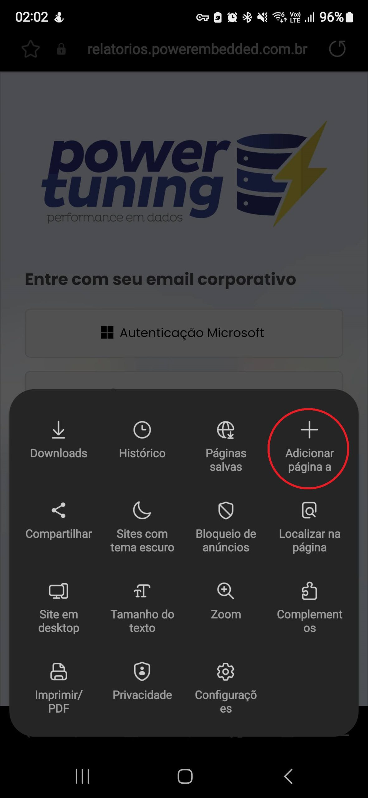<figcaption></figcaption></figure>

 

<figure>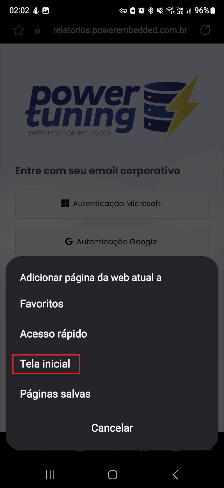<figcaption></figcaption></figure>

 

<figure>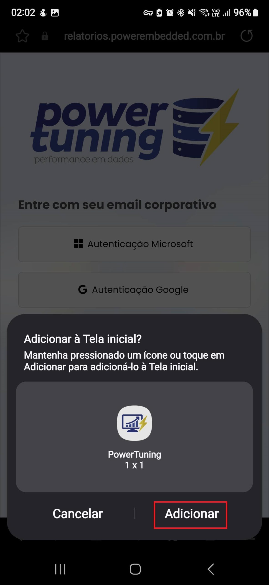<figcaption></figcaption></figure>

 

<figure><figcaption></figcaption></figure>

 

<figure><figcaption></figcaption></figure>

### Google Chrome

Para instalar o aplicativo móvel do Power Embedded, acesse o portal de relatórios, seja com a URL padrão (relatorios.powerembedded.com.br) ou utilizando a sua URL personalizada.

**Android:**

1. Toque no ícone do menu do navegador e selecione a opção “Instalar aplicativo”
2. &#x20;No pop-up que apareceu, clique no botão “Instalar”
3. Você verá uma notificação que o aplicativo está sendo instalado.
4. Pronto! Você já verá o ícone do aplicativo na lista dos aplicativos do seu celular (não ficará na tela inicial, a não ser que você crie um atalho)

<figure>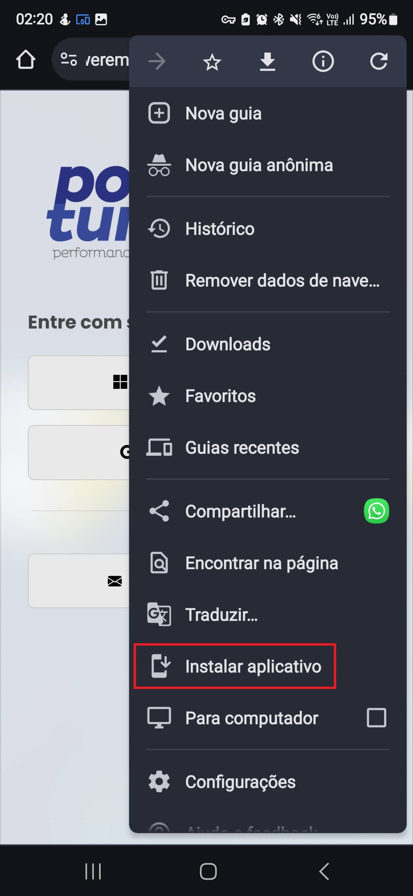<figcaption></figcaption></figure>

 

<figure>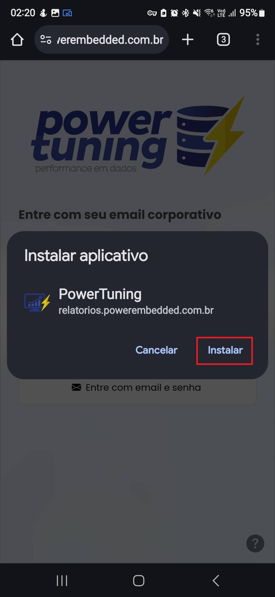<figcaption></figcaption></figure>

 

<figure><figcaption></figcaption></figure>

 

<figure>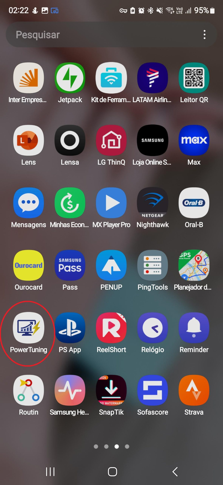<figcaption></figcaption></figure>

**iOS:**

1. Clique no ícone de compartilhar do lado direito da barra de endereços
2. No menu que foi aberto, clique no botão “Adicionar à Tela de Início”
3. Na janela de “Adicionar à Tela de Início”, clique no botão “Adicionar”
4. Pronto! Seu atalho já está disponível na tela inicial para ser utilizado.

<figure>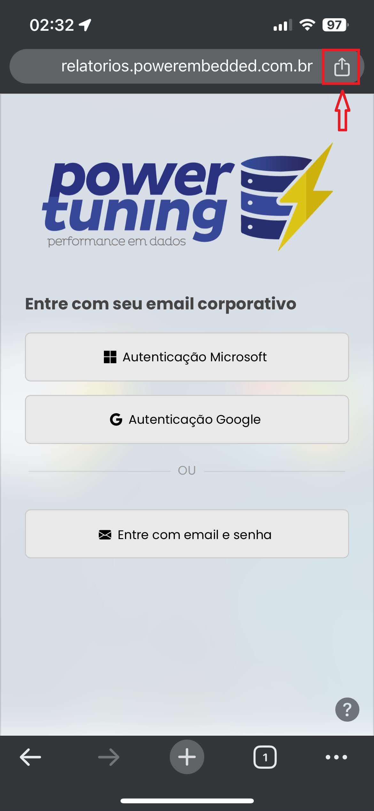<figcaption></figcaption></figure>

 

<figure>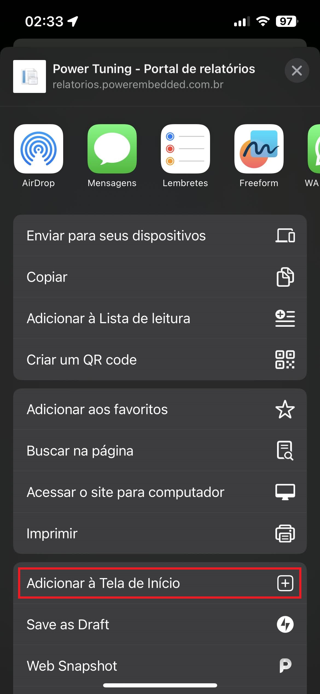<figcaption></figcaption></figure>

 

<figure>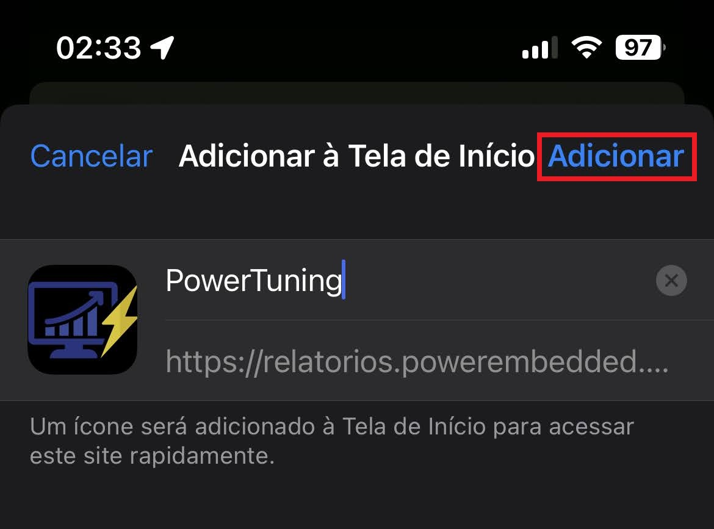<figcaption></figcaption></figure>

 

<figure>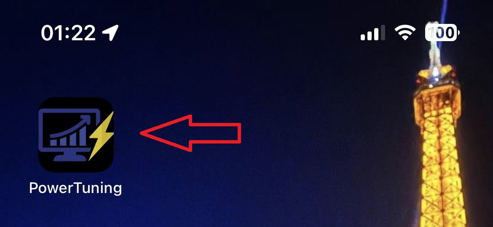<figcaption></figcaption></figure>

### Microsoft Edge

Para instalar o aplicativo móvel do Power Embedded, acesse o portal de relatórios, seja com a URL padrão (relatorios.powerembedded.com.br) ou utilizando a sua URL personalizada.

1. Toque no ícone do menu. Arraste para o lado, para ver as outras opções
2. Toque no ícone “Adicionar ao telefone”
3. No popup que apareceu, clique no botão “Instalar”
4. Na tela de “Adicionar à Tela Inicial”, clique no botão “Adicionar”
5. Pronto! Agora basta tocar no ícone criado na tela inicial para acessar o aplicativo.

<figure>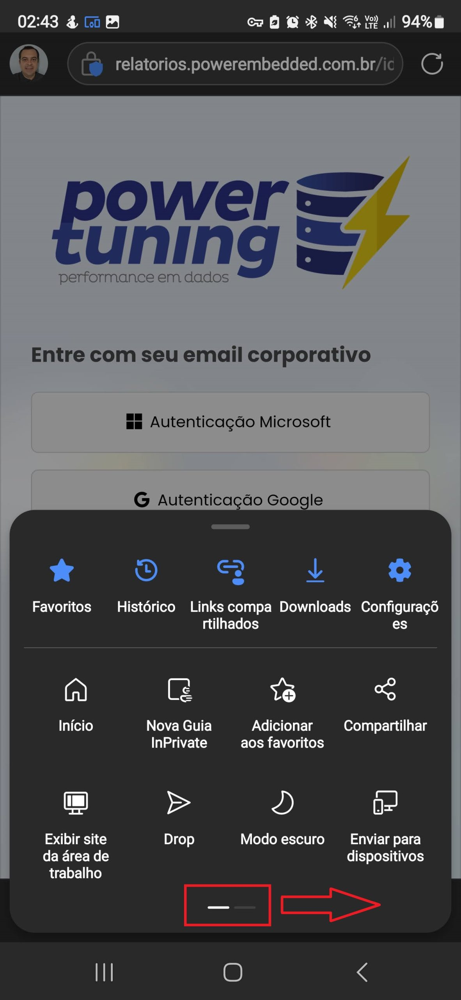<figcaption></figcaption></figure>

 

<figure>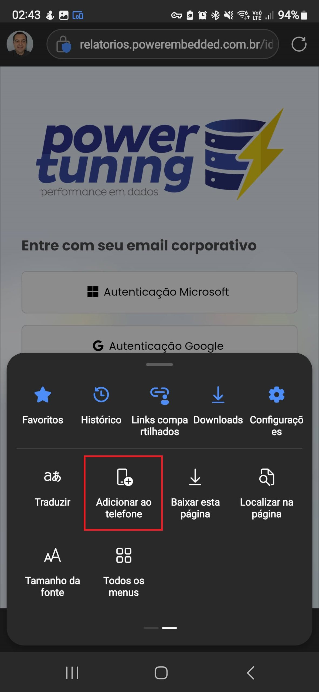<figcaption></figcaption></figure>

 

<figure>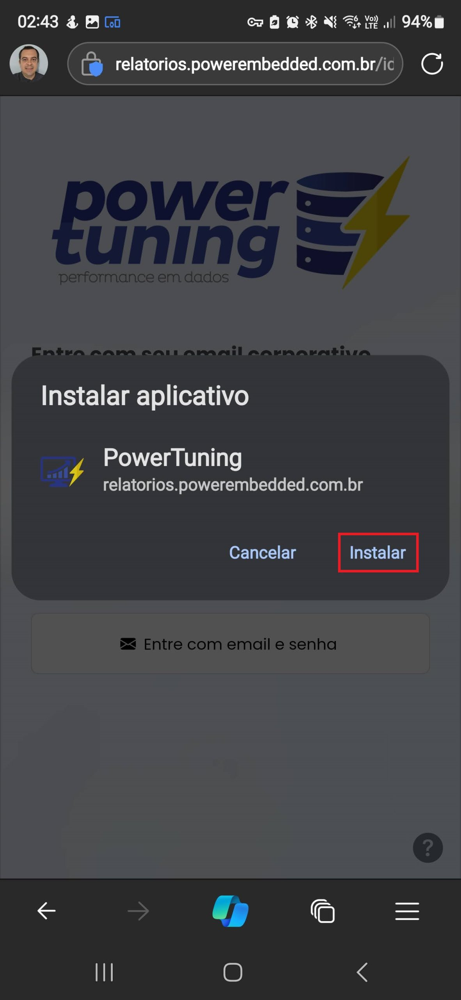<figcaption></figcaption></figure>

 

<figure>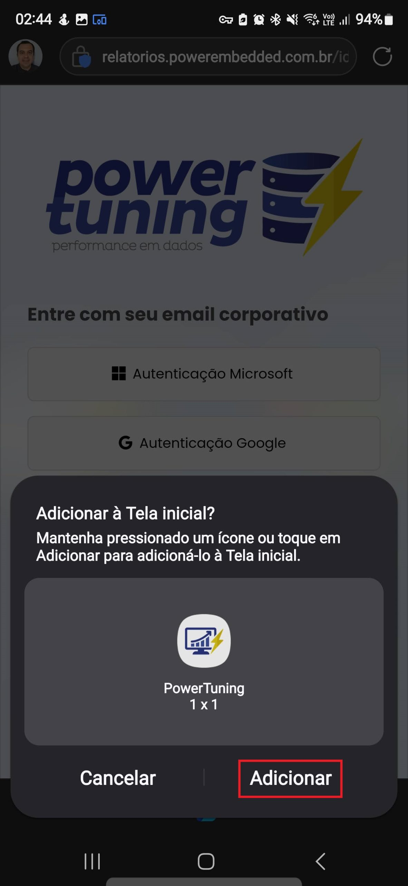<figcaption></figcaption></figure>

 

<figure><figcaption></figcaption></figure>

