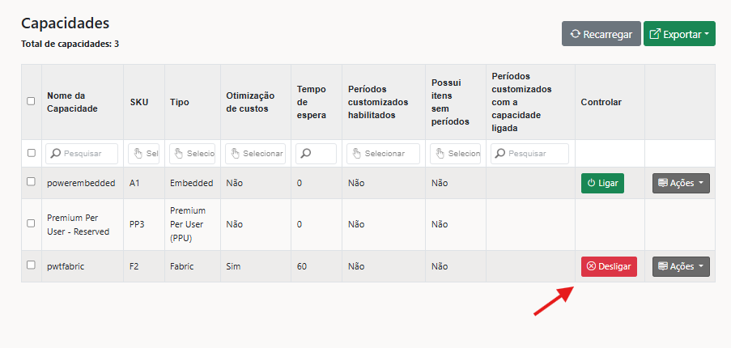
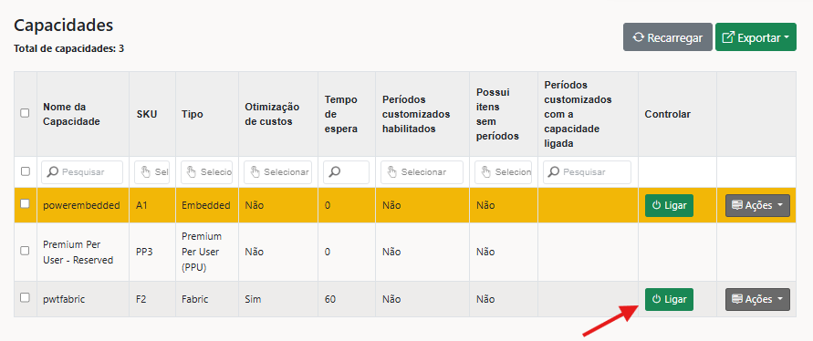
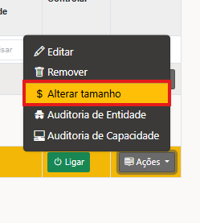

# Como reiniciar ou alterar a capacidade pelo Power Embedded


Utilize esta opção caso alguém do time de suporte do Power Embedded tenha indicado realizá-lo.


Se a opção de gerenciar a capacidade pelo portal não estiver sendo exibida, é porque ela não foi configurada. Clique no botão abaixo.



## Como reiniciar a capacidade

Acesse o menu de **artefatos** e selecione **capacidades**.

Clique na opção de **desligar** para pausar a capacidade.

<figure><figcaption></figcaption></figure>

Após desligar, aparecerá a opção de **"Ligar" ,** clique sobre ele e isso irá iniciar a capacidade novamente.

<figure><figcaption></figcaption></figure>

Feito esse processo, a capacidade irá ligar novamente e o ambiente de relatórios irá voltar ao normal.


Em alguns cenários, pode ser necessário aumentar o SKU da capacidade. Para realizar esse processo pelo Power Embedded, siga o passo abaixo. É importante lembrar que a alteração do SKU da capacidade impacta nos custos.


## Como alterar a capacidade pelo Power Embedded

Acesse o menu de **artefatos** e selecione **capacidades**.

Na capacidade contratada, clique em **ações** e depois em **alterar o tamanho**.

<figure><figcaption></figcaption></figure>

Na nova tela, selecione a opção de aumento desejada.

<figure><figcaption></figcaption></figure>

Escolha o SKU adequado para a sua necessidade e clique em **mudar capacidade**.

<figure><figcaption></figcaption></figure>

Ao fazer esse processo o recurso será alterado.

